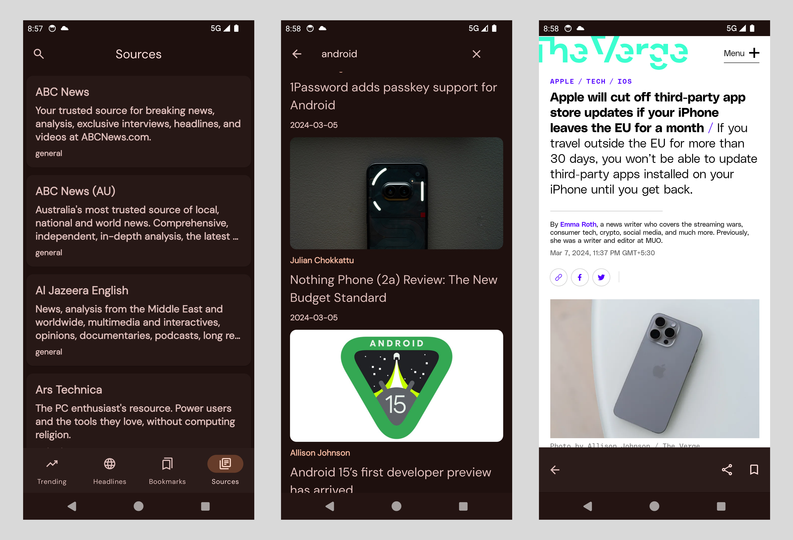

# News Caster MB -News App

### This app demonstrate the typical workflow when we working with http client like (Retrofit)

**This App will build upon on**

* `Android Views (XML)`.
* `Room` database for offline news cache.
* `Paging 3` library for loading large sets of data.
* `Retrofit` Http client for making network calls.
* `Dagger Hilt` for Dependency Injection.
* `Navigation Component` for fragment navigation.
* Reactive Ui using Kotlin Flows and Coroutines.
* Implemented Settings using PreferenceSettingCompat library.

### Features ✅

Main features of this news app.

- [x] Offline Article using Paging 3 Remote mediator.

- [x] Bookmark the Article for later offline read using Room persistence library.

- [x] Multiple News categories using Tab layout.

- [x] Edge to Edge (Drawing the UI behind the System bar).

- [x] Dark and Light theme support using PreferenceSettingLibrary.

- [x] Search a specific article.

- [x] Swipe to delete bookmarked news and more, ...

### Note 👀

#### Before you begin

**This App uses public api for fetching news article's named **NewsApi****

**This Api need a API_KEY for fetching news create a account on [NewsApi](https://newsapi.org/register) and include it on `AppConstants.API_KEY`**

_There is a some http request limit's if we cross it doesn't return any news_

### Improvement 🔧

**This Project tends to showcases the integration of Retrofit and some other libraries and also we don't have any control over the data all feature's will be based on that api**

**So adding many features / improvement will not worth for the time for projects like this for this reason's new features might not be implemented in this project**

### Contribution 🤝

If you like to contribute this project you can do it
As i already mention this project aims to showcases the different libraries for single Retrofit project to
scale this app further more.

All features and improvement should be committed on respective branches `features` branch for new features and `improvement` branch was improvement the existing feature.
